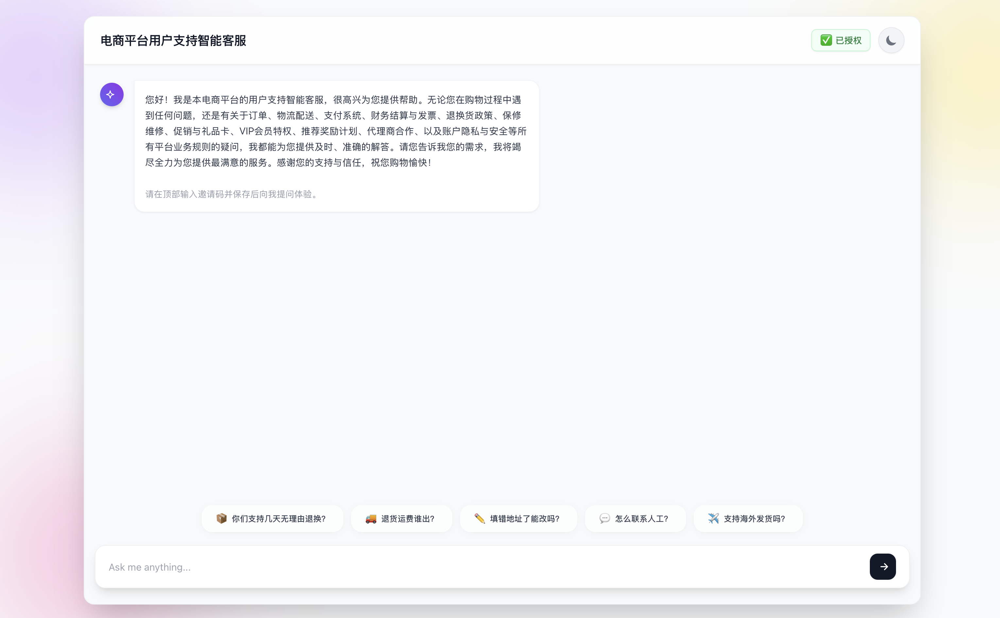

# E-Snap



一个基于 LangGraph 和 FastAPI 构建的企业级、高效率 AI 智能体，支持多领域架构，并通过 RedisVL 实现语义缓存。

本项目展示了构建生产级大模型（LLM）应用的完整方案，将前端展示与智能后端编排进行了无缝整合。

## 🌟 核心特性

- **两级缓存链路 (Two-Layer Cache Path):** 当前代码已经拆成 L1 `exact + near_exact fast path` + L2 `semantic cache`。L1 负责规则归一化后的快速命中并直接跳过 reranker，L2 负责语义候选召回与复用裁判。
- **语义缓存 (Semantic Caching):** 利用 RedisVL 和专用的嵌入模型 (`ep-m-2026...`) 对语义相似的问题进行缓存和快速返回，大幅降低 Token 消耗和响应延迟。
- **工作流编排 (Workflow Orchestration):** 基于 LangGraph 驱动，Agent 在回复用户前会先经过零层拦截、缓存分流、三态 reranker，再进入补充研究或完整 RAG。
- **全栈集成 (Full-Stack Integration):** FastAPI 一体化地提供复杂的后端 AI 逻辑服务和现代化的毛玻璃风格前端页面。无需处理跨域（CORS）烦恼，大大降低部署复杂度。
- **高品质用户体验:** 进阶版 UI 支持暗黑/明亮模式智能切换，拥有实时的发光 "Thinking" 思考状态提示，以及流式输出的应答体验。

## 缓存匹配机制

当前代码里的“模糊匹配”不是传统编辑距离算法，也不是 `difflib`。实际实现位于 [src/cache/engine.py](src/cache/engine.py)，由四层候选链路组成：

1. `exact`
    - 使用 `normalize_query()`：统一小写、裁剪首尾空格、折叠连续空白。
    - 适合完全同问或仅有普通空白差异的问题。
2. `near_exact`
    - 使用 `normalize_surface_query()`：在 `exact` 的基础上继续做 Unicode `NFKC` 归一化、去空格、去标点。
    - 适合“只差标点/全半角/格式噪声”的重复提问。
3. `subquery_exact / subquery_near_exact`
  - 当整句没有命中 `exact/near_exact` 时，会把复合问题按问号、逗号、句号以及 `另外/还有/以及/并且` 等连接词做轻量分句。
  - 如果其中某个子问题命中了历史缓存，会把它当作 reranker 候选，而不是直接整句直出。
  - 适合“前半句问过、后半句是新增问题”的复合提问。
4. `semantic`
    - 使用 RedisVL 向量检索做语义召回。
    - 命中后不会直接复用，而是进入 LLM reranker 进一步判断。

这意味着：
- 第一次经 RAG 回答过的问题，在写回缓存后再次原样提问，通常会变成 `exact` 或 `near_exact` 命中。
- 复合问题如果只部分覆盖缓存内容，不会被粗暴当成完整缓存命中，而是进入 `partial_reuse` 路径。

## 详细工作流

当前真实工作流如下，对应代码主要位于 [src/workflow/nodes.py](src/workflow/nodes.py)、[src/workflow/edges.py](src/workflow/edges.py)、[src/workflow/graph.py](src/workflow/graph.py)：

1. `pre_check_node`
    - 做“第零层拦截”。
    - 识别时间敏感问题、库存问题、特定商品型号问题。
    - 命中后直接返回固定回复，不进入缓存或 RAG。

2. `check_cache_node`
  - 先按 `exact -> near_exact -> subquery -> semantic` 的顺序找缓存候选。
    - `exact/near_exact` 命中会直接保留答案并进入快速直出。
  - `subquery/semantic` 命中只代表“找到了可供裁判的候选”，还不能直接复用答案。

3. `cache_router`
  - `exact` 或 `near_exact`：直接进入 `synthesize_response`。
  - `subquery_exact / subquery_near_exact / semantic`：进入 `rerank_cache_node`。
    - `none`：直接进入 `research_node`。

4. `rerank_cache_node`
    - 使用 `ANALYSIS_MODEL_NAME` 做三态判断：
      - `full_reuse`
      - `partial_reuse`
      - `reject`
    - `full_reuse` 表示缓存答案已经完整覆盖当前问题。
    - `partial_reuse` 表示缓存答案只覆盖了一部分，并会额外产出 `residual_query`。
    - `reject` 表示缓存答案不能安全复用，回退到完整研究。

5. `cache_rerank_router`
    - `full_reuse`：直接进入 `synthesize_response`。
    - `partial_reuse`：进入 `research_supplement_node`，只研究缺口问题。
    - `reject`：进入 `research_node`，走完整 RAG。

6. `research_node`
    - 使用 `RESEARCH_MODEL_NAME` 驱动工具调用。
    - 当前是单轮 RAG，但允许一次回答内部最多多次工具交互。
    - 工具为 `search_knowledge_base`。

7. `research_supplement_node`
    - 只围绕 `residual_query` 做补充研究。
    - 然后把“缓存已覆盖答案”和“新补充的信息”合并成最终回复。

8. `synthesize_response_node`
    - 统一输出最终答案。
    - 如果本次答案来自 research 或 supplement research，会把当前完整问答写回缓存。
    - 因此一个第一次通过 RAG 回答的问题，下一次再问时很可能就会变成 `exact` 或 `near_exact`。

## 响应标签含义

当前前端标签与后端 `label_key` 一一对应：

- `Zero-Layer Intercept`
  - 命中了 `pre_check_node` 的零层拦截。
- `Exact Cache Hit`
  - 命中了 `exact` 缓存直出。
- `Near-Exact Cache Hit`
  - 命中了 `near_exact` 缓存直出。
- `Reranked Cache Reuse`
  - 命中了非快速直出候选（例如 `semantic` 或 `subquery_*`），并被 reranker 判定为 `full_reuse`。
- `Partial Cache Reuse + RAG`
  - 命中了 `semantic` 或 `subquery_*` 候选，并被 reranker 判定为 `partial_reuse`，随后又做了补充研究。
- `LLM Analysis / Full RAG`
  - 未命中缓存，或缓存候选被 reranker `reject`，最终走完整 RAG。

## 📂 架构与目录结构
有别于常规的玩具项目，本代码库拥抱领域驱动设计（DDD）。我们不是简单地将代码分为 `frontend` 和 `backend`，**`src/` 目录正是整个应用的大脑核心。**

```text
.
├── frontend/             # 前端静态资源 (HTML, CSS, JS 及毛玻璃特效 UI)
├── data/                 # 数据集 (包含电商客服白皮书知识库等)
├── tests/                # 测试套件 (测试代码和评测脚本)
└── src/                  # 核心后端逻辑 (Python)
    ├── api/              # 网关与路由 (FastAPI 服务器、路由挂载)
    ├── workflow/         # 智能工作流 (LangGraph Node、Edge、状态和提示词)
    ├── cache/            # 缓存与性能 (当前为 L1 exact + L2 RedisVL semantic)
    ├── knowledge/        # 知识库层 (文档解析机制、Embedding 嵌入)
    └── common/           # 基础设施层 (日志配置、环境变量安全)
```

## 🚀 极速启动与部署指南

### 1. 环境准备
- **Python 3.11+**
- **Redis Stack Server** (重要：由于本系统依赖 RedisVL 提供的向量和语义搜索能力，普通的 `redis` 无法运行。请必须安装 `redis-stack` 或带有 `search` 扩展的 Redis 服务器，例如 macOS 下使用 `brew install redis-stack` 后用 `redis-stack-server` 启动，或直接通过 Docker 运行 `redis/redis-stack:latest`。如果启动时出现 `Failed listening on port 6379` 或 `bind: Address already in use`，说明本机已经有一个 Redis/Redis Stack 实例占用了 6379，此时应复用已有实例或先停止旧实例，而不是重复启动第二个服务。)
- **大模型 API Key**（如: 火山引擎/豆包模型 ARK_API_KEY，或其他接入渠道）

### 2. 安装依赖
建议使用虚拟环境以避免依赖冲突：
```bash
python3 -m venv .venv
source .venv/bin/activate
.venv/bin/python -m pip install -r requirements.txt
```

### 3. 配置环境变量
如果仓库根目录已经有可用的 `.env`，请直接复用，不要覆盖它。只有首次初始化新环境时，才需要从模板复制一份：
```bash
cp .env.example .env
```
说明：应用启动时会自动读取根目录下的 `.env`，不需要手动 `source .env`。其中 `ARK_API_KEY` 必填；`REDIS_URL` 默认是 `redis://localhost:6379`，只有在 Redis 不跑本机默认端口时才需要改。当前代码把缓存配置拆成了 `CACHE_L1_EXACT_ENABLED` 与 `CACHE_L2_DISTANCE_THRESHOLD` 两层，便于后续把向量层迁移到 Qdrant、而把 Redis 专注在 L2 响应缓存与限流。

### 当前存储建议
- 当前最小可运行实现：L1 为 exact fast path，L2 与 RAG 向量都暂时仍由 Redis/RedisVL 承载。
- 推荐的下一步物理形态：向量相关统一迁移到 Qdrant（缓存向量集合 + RAG 文档集合），Redis 保留给 L2 响应缓存、精确键索引、限流与轻量元数据。

`.env.example` 的作用：
- 作为新机器/新同学首次启动时的配置模板
- 作为可安全提交到仓库的环境变量示例
- 如果您本地已经有正确的 `.env`，则启动项目时可以完全忽略 `.env.example`

### 4. 启动统一服务
整个前端体系已纯净挂载入 FastAPI 应用中，您仅需一条命令即可启动完整的全栈系统！
```bash
export PYTHONPATH=$(pwd)/src:$PYTHONPATH
.venv/bin/python -m uvicorn src.api.server:app --host 127.0.0.1 --port 8000 --reload
```
启动后请先等待终端出现 `Python executable: .../.venv/bin/python`、`Agent System Ready!` 和 `Application startup complete.`，再打开浏览器或点击快捷问题。因为 FAQ 预热、知识库构建和 Redis 初始化都发生在端口绑定之后。如果您看到的是 `/opt/homebrew/.../python`，说明当前服务并不是从项目虚拟环境启动的。

### 5. 开始体验
打开浏览器访问 **[http://127.0.0.1:8000](http://127.0.0.1:8000)** 即可开始与您的智能客服智能体对话！

### 6. 运行测试
#### 运行默认测试集（`data/test_scenarios.json`）
```bash
PYTHONPATH=. .venv/bin/python src/main.py
```

#### 运行完整测试集（`data/test_scenarios_full.json`）
```bash
TEST_SCENARIO_PROFILE=full PYTHONPATH=. .venv/bin/python src/main.py
```

#### 运行完整测试集并打印控制台结果
```bash
TEST_SCENARIO_PROFILE=full SHOW_CONSOLE_RESULTS=true PYTHONPATH=. .venv/bin/python src/main.py
```

运行结果会覆盖写入 `outputs/run_summary.csv`（测试明细）和 `outputs/performance_report.txt`（聚合性能报表）。

#### 运行单元测试（路由 / 标签 / 导出契约 / scenario / 分类器）

```bash
PYTHONPATH=. .venv/bin/python -m unittest discover -s tests/unit -v
```

单测覆盖 `tests/result_classifiers.py` 路径分类、`tests/summary_schema.py` 导出契约、`tests/scenarios.py` 输入校验、`src/workflow/edges.py` 路由 (`pre_check_router` / `cache_router` / `cache_rerank_router`) 以及 `src/api/server.py` 的 `LABEL_RULES`。重构落地后任一阶段都应保持其全绿。

### 运行模式矩阵

| 模式 | 入口 | 后台缓存写回是否计入 `total_latency` | 主要指标输出 |
| --- | --- | --- | --- |
| 离线评测（默认） | `src/main.py` | 是（runner 等待 `wait_for_background_tasks`） | `outputs/run_summary.csv` + `outputs/performance_report.txt` |
| 离线评测（full） | `TEST_SCENARIO_PROFILE=full src/main.py` | 同上 | 同上 |
| 在线 `/chat` | FastAPI POST | 是（`_finalize_total_latency` 在返回前 `wait_for_background_tasks`） | 单次 `ChatResponse` |
| 在线 `/chat/stream` | FastAPI POST，`application/x-ndjson` | 是（`final` 事件前同步 `wait_for_background_tasks`） | 流式 `status` / `token` / `final` / `error` 事件 |

注：在线响应的 `metrics.total_latency` 与离线 runner 的口径已经统一 —— 都包含子问题缓存后台写回；用户感知的"首屏延迟"通常显著小于 `total_latency`（流式接口可观察 `token` 首块时间）。

### API 关键端点

- `POST /validate` — 校验访问码；前端 `setSuccessUI` 使用。
- `POST /chat` — 同步问答，返回 `ChatResponse`（含 `label_key` / `label_text` / `cache_written_prompts`）。
- `POST /chat/stream` — 流式问答，事件类型见 `STREAM_EVENT_*` 常量（`status` / `token` / `final` / `error`）。
- `GET /labels` — 返回 `label_key → text` 的映射表，作为前端 badge 文案的单一来源；CSS class 仍由前端 `BADGE_CONFIG` 持有。
- `GET /health` — 启动状态探针（`ready` / `stage` / `message` / `error`）。

当前 `performance_report.txt` 已接入真实 token 与人民币成本指标：
- `ANALYSIS_MODEL_NAME` 按 Doubao-Seed-2.0-lite 基础模型低档价格计费：输入 `0.0006` 元/千tokens，输出 `0.0036` 元/千tokens，缓存命中输入 `0.00012` 元/千tokens。
- `RESEARCH_MODEL_NAME` 按 DeepSeek-V3.2 基础模型价格计费：输入 `0.0020` 元/千tokens，输出 `0.0030` 元/千tokens，缓存命中输入 `0.00040` 元/千tokens。
- 仅统计 API 实际返回的 usage metadata；本地 Redis 语义缓存命中不额外计厂商 token 费用，prompt cache storage 费用当前按 `0` 处理。
- 离线测试链路会等待后台子问题缓存线程完成，因此报表中的 token / RMB 成本比在线单次响应日志更完整。

---

## 📚 知识库更新指南 (重要)

如果在此后需要修改或扩展机器人的知识覆盖范围（例如修改了 `data/raw_docs.md` 平台白皮书），您需要执行以下操作来使修改生效：
1. **清理旧版缓存**: 删除旧的向量存储/语义缓存以防拿到脏数据。
2. **重启系统**: 重启 `uvicorn` 服务，以便 Agent 重新读取和预处理更新后的 `raw_docs.md`。
